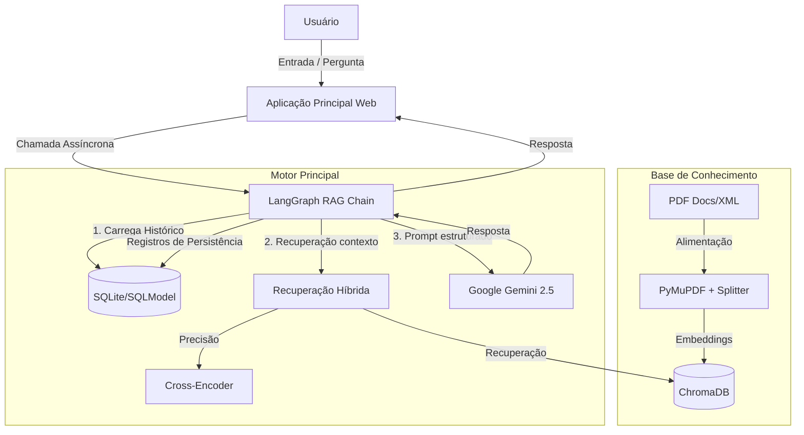
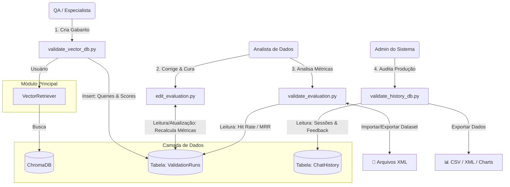
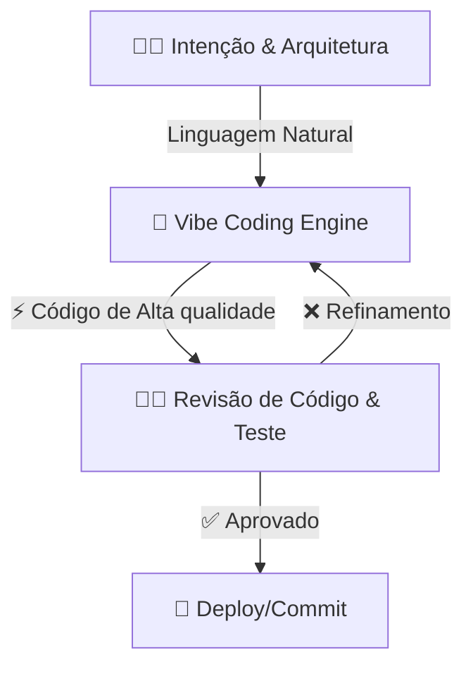

# 🏛️ Chatbot RAG - Programa Quita Goiás

> **Arquitetura:** Modular Monolith Async | **Orquestração:** LangGraph | **LLM:** Google Gemini 2.5 Flash


Este projeto implementa um assistente virtual de alta performance baseado em **RAG (Retrieval-Augmented Generation)**.
Projetado para responder dúvidas sobre legislação tributária com precisão, ele utiliza uma arquitetura assíncrona moderna, persistência estruturada via **SQLModel** e um pipeline de recuperação híbrida (Vetorial + Re-ranking).

O grande diferencial é a sua **Suíte de Auditoria e Avaliação (QA Suite)**, que permite a criação de "Gabaritos" (Ground Truth) persistentes no banco de dados, garantindo transparência e métricas auditáveis (Hit Rate, MRR, Precision@K).

-----

## 💡 Dica de Visualização (Diagramas)

Este documento contém diagramas de arquitetura complexos usando a sintaxe **Mermaid**. Para visualizá-los corretamente (renderizados como gráficos e não como código), recomenda-se o seguinte ambiente:

* **Editor de Código:** [Visual Studio Code (VS Code)](https://code.visualstudio.com/download)
* **Extensão Recomendada:** [Markdown Preview Mermaid Support](https://marketplace.visualstudio.com/items?itemName=bierner.markdown-mermaid) (por Matt Bierner).

---

## 🧩 Arquitetura da Solução

O sistema opera de forma assíncrona para garantir fluidez na UI enquanto processa chamadas pesadas de LLM e Banco de Dados.




### Fluxo de Trabalho de Dados e QA

Este diagrama ilustra como as ferramentas de suporte (`validate_*.py` e `edit_*.py`) interagem para garantir a qualidade contínua do chatbot.



### Destaques Técnicos

  * **Hybrid Retrieval:** Combina a velocidade da busca vetorial (`all-MiniLM-L6-v2`) com a precisão semântica de um Cross-Encoder (`ms-marco-MiniLM-L6-v2`) para reordenar os resultados.
  * **LangGraph:** Orquestração de estado (*Stateful*) para gerenciar o fluxo de conversação e memória de curto prazo.
  * **Async SQLModel:** Uso de `aiosqlite` e `SQLAlchemy 2.0` para persistência não-bloqueante de históricos, feedbacks e métricas de validação.
  * **Auditabilidade Total:** Todas as validações manuais (Gabaritos) são salvas no banco de dados, permitindo a reprodução de testes e auditoria de viés.

-----


## 📂 Estrutura do Projeto

```text
📂 rag_chatbot
│
├── 📂 docs/                        # [Input] Coloque aqui seus PDFs e XMLs
│
├── 📂 database/                    # [Storage] Persistência Relacional
│   └── 💾 chat_solution.db         # Histórico, Feedbacks e Validações
│
├── 📂 vector_db/                   # [Storage] Banco Vetorial ChromaDB
│   └── 💾 ...                      # Arquivos do ChromaDB
│
├── 📜 app.py                       # [App] Interface de Chat (Produção)
├── 📜 rag_chain.py                 # [Core] Lógica RAG e LangGraph
├── 📜 vector_retriever.py          # [Core] Motor de Busca (Recall + Rerank)
├── 📜 database.py                  # [Model] Schemas do Banco (SQLModel)
├── 📜 settings.py                  # [Config] Variáveis de Ambiente e Caminhos
├── 📜 ui_utils.py                  # [Utils] Helpers de UI (Impressão, Foco)
│
├── 🔧 ETL & Ingestão
│   ├── 📜 ingest.py                # Pipeline PDF -> Chunks Fixos -> VectorDB
│   └── 📜 ingest_xml.py            # Pipeline XML -> Chunks Semânticos -> VectorDB
│
└── 🛠️ Ferramentas de Auditoria & QA
    ├── 📜 validate_vector_db.py    # [Coleta] Teste de Retrieval e Criação de Gabarito
    ├── 📜 edit_evaluation.py       # [Curadoria] Editor para corrigir avaliações e recalcular métricas
    ├── 📜 validate_evaluation.py   # [Análise] Dashboard de Métricas (HR, MRR, P@K)
    └── 📜 validate_history_db.py   # [Auditoria] Logs de Produção, Gráficos e Feedbacks

```

## 🚀 Instalação e Configuração

### 1\. Pré-requisitos

  * Python 3.10+
  * Chave de API do Google AI Studio (`GEMINI_API_KEY`)

### 2\. Configuração do Ambiente

**Opção A: Usando `venv` (Padrão do Python)**

```bash
# 1. Crie o ambiente (usando o nome 'rag_solution')
python -m venv rag_solution

# 2. Ative o ambiente
# Windows
.\rag_solution\Scripts\activate
# macOS/Linux
source rag_solution/bin/activate
```

-----

**Opção B: Usando `conda` (Anaconda)**

```bash
# 1. Crie o ambiente (usando o nome 'rag_solution' e especificando Python 3.10+)
conda create -n rag_solution python=3.10

# 2. Ative o ambiente
conda activate rag_solution
```

### 3. Instalação das Dependências

Com o ambiente virtual (`rag_solution`) ativo, instale todas as bibliotecas listadas no `requirements.txt`:

```bash
pip install -r requirements.txt
```

### 4\. Variáveis de Ambiente

Crie um arquivo `.env` na raiz do projeto:

```ini
GEMINI_API_KEY="sua_chave_aqui"
DATABASE_URL="sqlite+aiosqlite:///./database/chat_database.db"
```

### 5\. Ingestão de Dados

Coloque seus arquivos na pasta `docs/` e execute o pipeline correspondente ao formato dos seus dados:

**Opção A: Arquivos PDF (Ingestão Padrão)**

Para processar documentos PDF brutos. O sistema fará a limpeza, sanitização e divisão (splitting) automática baseada em caracteres.

```bash
python ingest.py
```

**Opção B: Arquivos XML (Semantic Chunking)**

Para ingerir dados que já passaram por um processo de "Semantic Chunking" externo e estão estruturados em XML (Pergunta/Resposta/Metadados).

```bash
python ingest_xml.py
```

*(Nota: Ambos os scripts recriam automaticamente as pastas `database/` e `vector_db/`. **Execute apenas um dos scripts**, dependendo de qual fonte de dados você deseja utilizar no momento.)*

-----

## 🖥️ Guia de Utilização

O projeto é composto por **5 aplicações Streamlit** distintas. Execute-as em terminais separados conforme a necessidade.

### 1\. Chatbot (Produção)

A interface principal para o usuário final.

```bash
streamlit run app.py
```

### 2\. Suíte de Avaliação (Data-Driven Development)

Ferramentas para engenheiros e especialistas de domínio validarem a qualidade do bot.

#### A. Coleta de Métricas (O "Gabarito")

Ferramenta para testar queries e marcar manualmente quais chunks são relevantes. Essencial para calcular a precisão do sistema.

```bash
streamlit run validate_vector_db.py
```

> **Fluxo de Uso:**
>
> 1.  Digite uma pergunta.
> 2.  Veja os resultados do RAG.
> 3.  Marque os checkboxes dos trechos corretos (**Hit Rate**).
> 4.  Selecione o melhor trecho no Radio Button (**MRR**).
> 5.  Salve a avaliação.

#### B. Dashboard de Performance

Analisa os dados coletados na etapa anterior, exibindo métricas consolidadas.

```bash
streamlit run validate_evaluation.py
```

  * **Métricas:** Hit Rate, MRR, Precision@K e Precision@1.
  * **Import/Export:** Permite importar dados validados de XML para análises históricas.


#### C. Auditoria de Histórico

Monitora o uso real em produção.

```bash
streamlit run validate_history_db.py
```

  * **Resumo Visual:** Gráficos de Pizza interativos comparando satisfação (Likes/Dislikes) entre Usuários Reais e Testes Sintéticos.
  * **Backup:** Exportação completa do histórico de conversas e feedbacks para XML e CSV.

-----

## 📊 Entendendo as Métricas

| Métrica | O que mede? | Interpretação |
| --- | --- | --- |
| **Hit Rate** | Capacidade de encontrar *alguma* resposta útil. | Se a resposta certa apareceu (mesmo em 3º lugar), é 1. Se não, 0. |
| **MRR** | Qualidade da ordenação (Ranking). | Se a melhor resposta é a 1ª, MRR=1.0. Se for a 2ª, MRR=0.5. Se for a 3ª, MRR=0.33. |
| **Precision@K** | Densidade | Quanto "ruído" veio junto? (Ex: 2 chunks úteis de 3 = 0.66) |
| **Precision@1** | "Tiro Certeiro" | O 1º resultado sozinho responde à pergunta? |


-----

## 🛠️ Stack Tecnológico

  * **Frontend:** Streamlit 1.50 (com Altair Charts)
  * **Core AI:** LangChain 1.0, LangGraph, Google Gemini 2.5
  * **Data:** SQLModel (SQLAlchemy + Pydantic), ChromaDB (Vector Store)
  * **NLP:** Sentence-Transformers (Embeddings + Cross-Encoders)
  * **Utils:** PyMuPDF, Python-Dotenv

-----

## 6\. 🔄 Nota sobre o Desenvolvimento: A Abordagem "Vibe Coding"

Este projeto foi construído utilizando o paradigma de Vibe Coding (Intent-Based Programming). 
Diferente da codificação tradicional, aqui o foco deslocou-se da sintaxe manual para a arquitetura, fluxo de dados e regras de negócio, enquanto a IA assumiu a implementação pesada com padrões de engenharia modernos.


A colaboração seguiu uma dinâmica fluida de "Human-in-the-Loop":

  * **👨‍💻 Engenheiro Humano (Arquiteto & Vibe Keeper):**

      * Responsável pela **Intenção e Visão**: Definição do "quê" e do "porquê".
      * Arquitetura de Solução: Escolha da stack (LangGraph, SQLModel, Streamlit).
      * Curadoria de Código: Revisão crítica de segurança, lógica de negócios e auditoria de métricas.

  * **🤖 Google Gemini (AI Pair Programmer):**

      * Implementação "Zero-Friction": Transformação de prompts em linguagem natural diretamente em código Python tipado, assíncrono e documentado.
      * Refatoração Proativa: Aplicação imediata de Design Patterns e migração de scripts síncronos para asyncio.
      * Manutenção de Contexto: Geração de testes e documentação técnica alinhada ao estilo do projeto.
      * Refatoração para padrões modernos (migração para `async/await`).

  * **🔄 Fluxo de Trabalho:**
    
    * **Intenção**: O desenvolvedor define o objetivo (ex: "Criar um dashboard de auditoria com gráficos").
    * **Vibe Coding**: A IA gera a solução completa seguindo as diretrizes de qualidade do projeto.
    * **Refinamento**: Ajustes finos de UI/UX e validação de lógica pelo humano.



